# vpc-terraform-module

## REUSABLE VPC TERRAFORM MODULE FOR SANDBOX, STAGING, AND PRODUCTION ENVIRONMENTS.

# Introduction
In modern cloud infrastructure, managing Virtual Private Clouds (VPCs) efficiently is crucial for ensuring secure and scalable networking across different environments. This project aims to develop a reusable VPC Terraform module tailored for **sandbox, staging, and production environments**. By leveraging Terraform’s Infrastructure as Code (IaC) capabilities, we ensure a **consistent, automated, and repeatable** approach to provisioning VPCs across multiple AWS accounts. The primary objective is to create a structured and maintainable Terraform module that can be utilized across different environments while adhering to best practices for AWS networking.

The project follows a systematic approach:

1. Setting up AWS accounts for non-production and production environments.

2. Configuring AWS CLI for seamless authentication.

3. Structuring the Terraform project for modular and environment-specific configurations.

4. Deploying and verifying VPCs across different environments.

5. Handling potential errors and troubleshooting issues effectively.

## Step 1: Create AWS Accounts for Non-Production and Production

AWS Organizations allows you to create and manage multiple AWS accounts under a single master account. If you do not have separate accounts for **NonProd** and **Prod**, follow these steps:

**1.1 Sign in to AWS Organizations**

1. Log in to your AWS Management Console using the root user of your main AWS Organization.
2. Navigate to AWS Organizations:

   - Go to **Services** → **AWS Organizations.**

    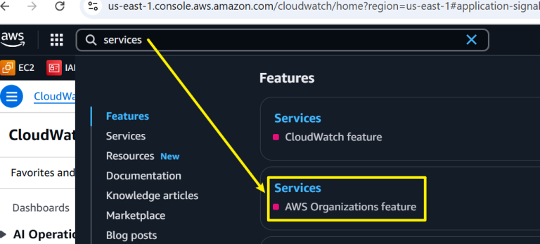

**1.2 Create a New Account for Non-Production**

1. Click **Create an organization.**
   
   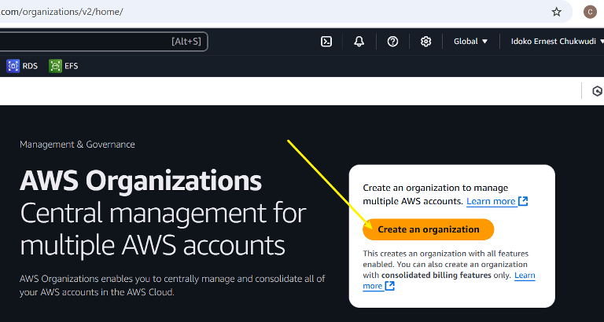

2. Click **Add an AWS account** → **Create an AWS account.**

    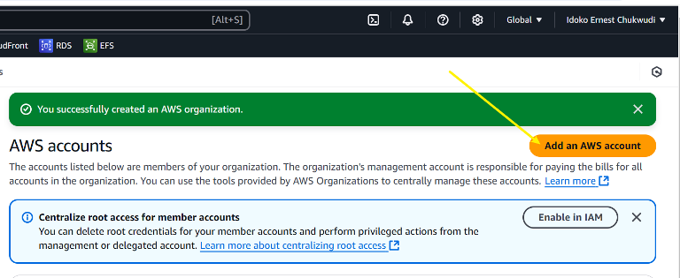

    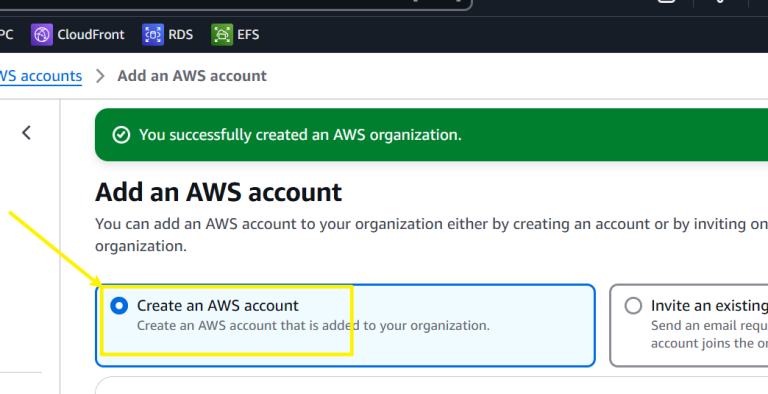

3. Enter the Account name: `NonProd` AWS Account.
4. Enter a unique Email address (different from the root account).
5. Choose an IAM Role Name (e.g. `OrganizationAccountAccessRole`).
6. Click **Create AWS Account**.

    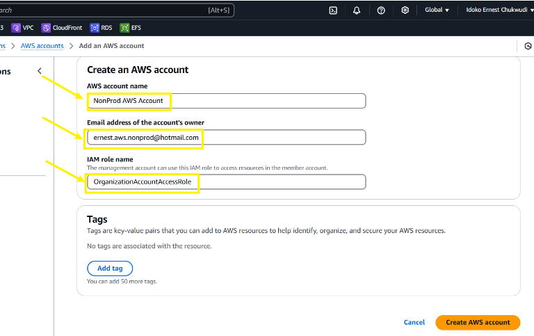

**1.3 Create a New Account for Production**

1. Repeat the same steps above but enter:
   - Account name: `Production AWS Account`
   - A separate **Email address**.

    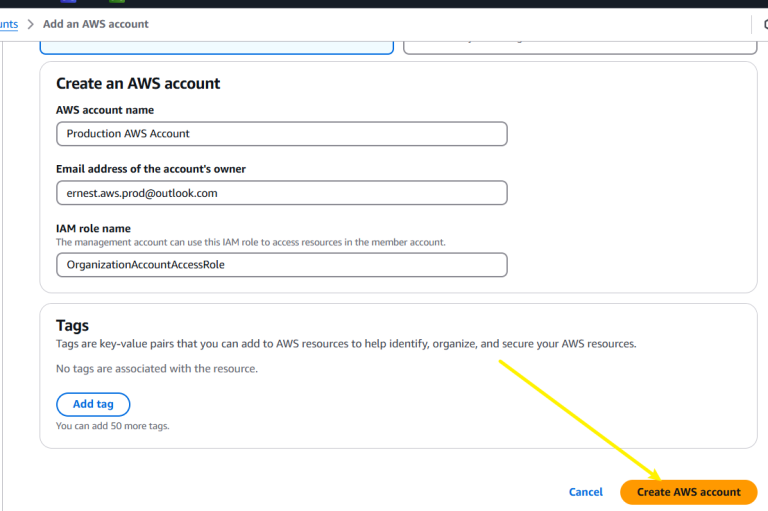

**1.4 Verify the Accounts**
- Check your email inbox for verification emails from AWS.
- Confirm the accounts by clicking on the verification links.

    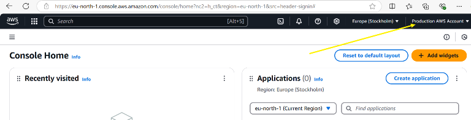

    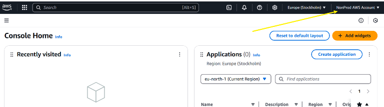

## Step 2: Set Up AWS CLI Access for Both Accounts

Once the AWS accounts are created, configure them for Terraform access.

**2.1 Install AWS CLI**

If AWS CLI is not installed, download and install it:

```
curl "https://awscli.amazonaws.com/AWSCLIV2.pkg" -o "AWSCLIV2.pkg"
sudo installer -pkg AWSCLIV2.pkg -target /
```

Verify installation:

```
aws --version
```

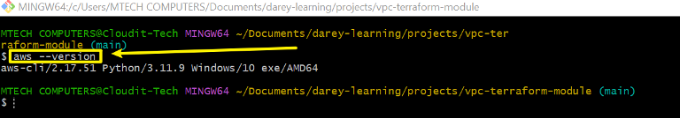

**2.2 Configure AWS CLI for Non-Prod**

Log in to your `Non-Prod AWS account` and retrieve the `Access Key ID` and `Secret Access Key` from IAM.

Run:

```
aws configure --profile nonprod
```

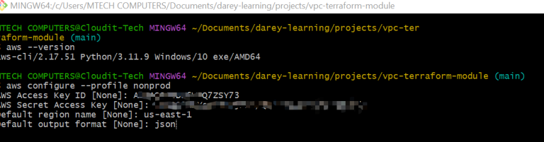

**2.3 Configure AWS CLI for Production**

```
aws configure --profile prod
```

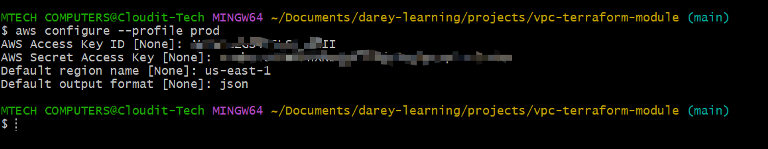

**2.4 Verify Configuration**

Run:

```
aws s3 ls --profile nonprod
aws s3 ls --profile prod
```
If successful, this confirms the credentials are correctly configured.

## Step 3: Project Structure

To keep our Terraform project well-organized, we will structure it as follows:

```
vpc-terraform-module/
│── modules/
│   └── vpc/
│       ├── main.tf
│       ├── variables.tf  ✅ (Defines required inputs for the module)
│       ├── outputs.tf
│── environments/
│   ├── sandbox/
│   │   ├── main.tf
│   │   ├── variables.tf ✅ (Provides values for the module)
│   │   ├── terraform.tfvars
│   ├── staging/
│   │   ├── main.tf
│   │   ├── variables.tf ✅ (Provides values for the module)
│   │   ├── terraform.tfvars
│   ├── production/
│   │   ├── main.tf
│   │   ├── variables.tf ✅ (Provides values for the module)
│   │   ├── terraform.tfvars
│── versions.tf
│── providers.tf
│── README.md
│── terraform.tfvars
│── terraform.tfstate
│── .gitignore
```

- The `modules/vpc/` directory contains our reusable module.
- The `environments/` directory has separate configurations for **sandbox, staging,** and **production**.
- The `versions.tf` and `providers.tf` ensure Terraform compatibility and provider setup.
- The `README.md` documents this project.

## Step 4: Define the VPC Module

In the `modules/vpc/` directory, create the following files:

**4.1 `main.tf`(VPC Module)**

This file defines the Terraform resource for creating a VPC.

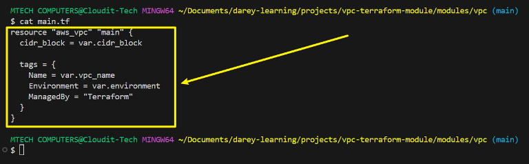

- `aws_vpc` creates the VPC.
- `cidr_block` is dynamically set using a variable.
- Tags ensure proper identification and tracking.

**4.2 `variables.tf` (VPC Module)**

Defines variables to parameterize the module.

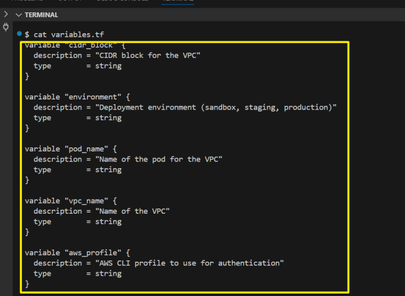

These variables allow us to reuse the module across environments.

**4.3 `outputs.tf` (VPC Module)**

Defines outputs to reference in other configurations.

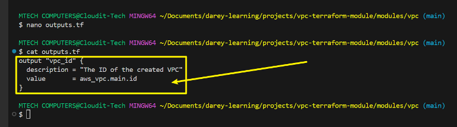

Outputs the `VPC ID`, which can be used in networking resources later.

## Step 5: Define Environment-Specific Configurations

Each environment (**sandbox, staging, production**) will have its own configuration.

**5.1 Define `main.tf` for Each Environment**

For `sandbox/main.tf`:

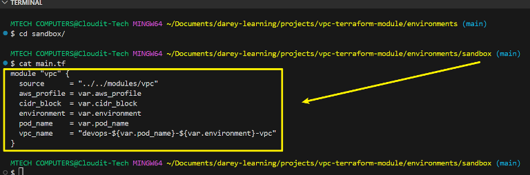

This calls the VPC module, passing environment-specific values.

For `staging/main.tf`:

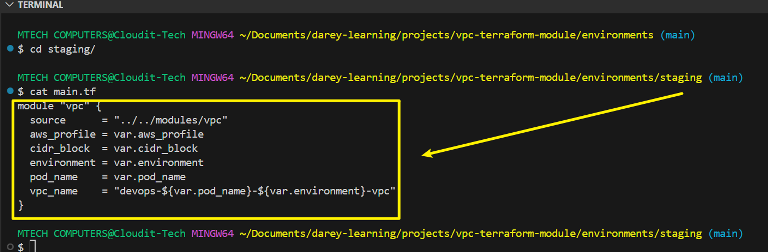

For `production/main.tf`:

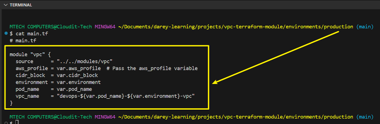

**5.2 Define `terraform.tfvars` for Each Environment**

For `sandbox/terraform.tfvars`:

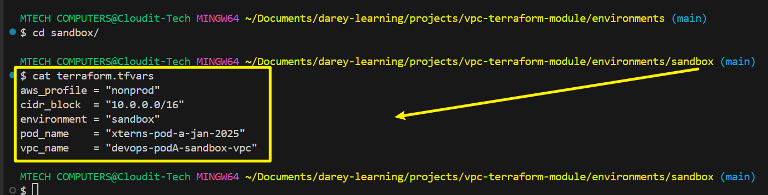


For `staging/terraform.tfvars`:

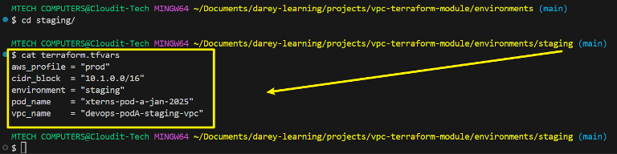

For `production/terraform.tfvars`:

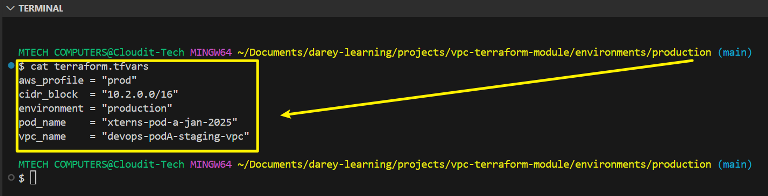

## Step 6: Set Up Terraform Backend and Provider Configuration

**6.1 Define `providers.tf`**

Configures AWS as the provider.

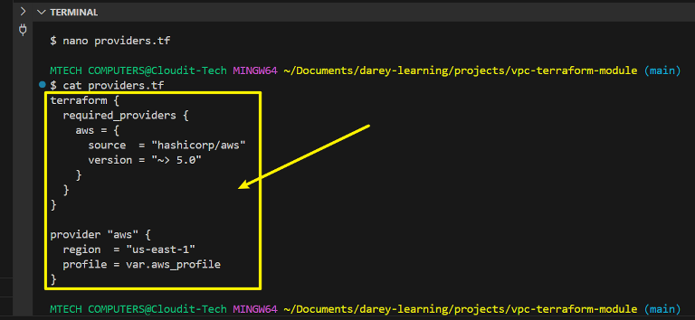

**6.2 Define `versions.tf`**

Locks Terraform versions.

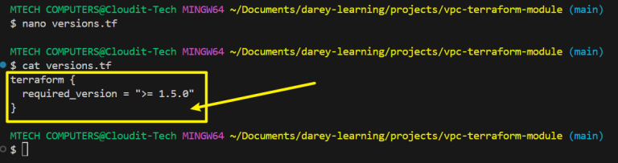

Ensures compatibility with Terraform 1.5.0+.

## Step 7: Deploy VPCs in Different AWS Accounts

**NOTE:** Ensure Your AWS CLI is Using the Correct Profile

Before running Terraform, set your AWS profile in the session:

```
export AWS_PROFILE=nonprod   # For sandbox
export AWS_PROFILE=prod      # For production
```

Verify Profile Access

Run:

```
aws sts get-caller-identity
```
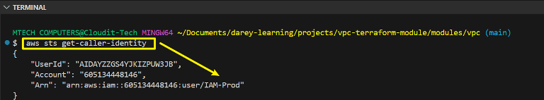

This should return details of the currently authenticated AWS account.


**7.1 Initialize Terraform**

Run this command in each environment folder:

```
terraform init
```

For `sandbox environment`

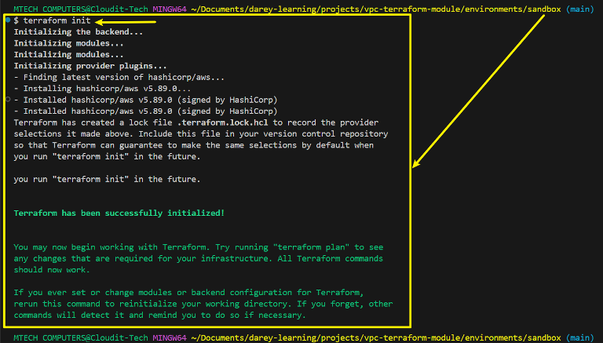

For `staging environment`

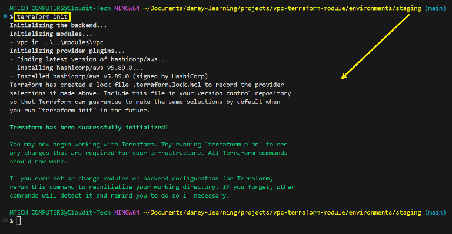


For `production environment`

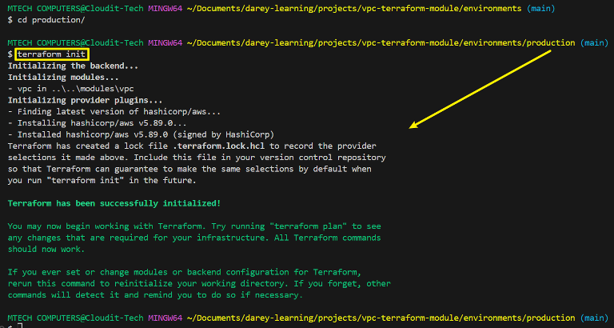

**Terraform initialization** is `environment-specific` to ensure that each environment has the correct providers, state, and configurations.

**7.2 Plan the Deployment**

For `sandbox`:

Run:

```
terraform plan -var-file=terraform.tfvars
```

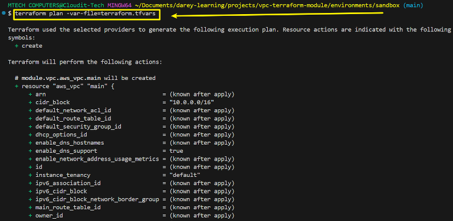

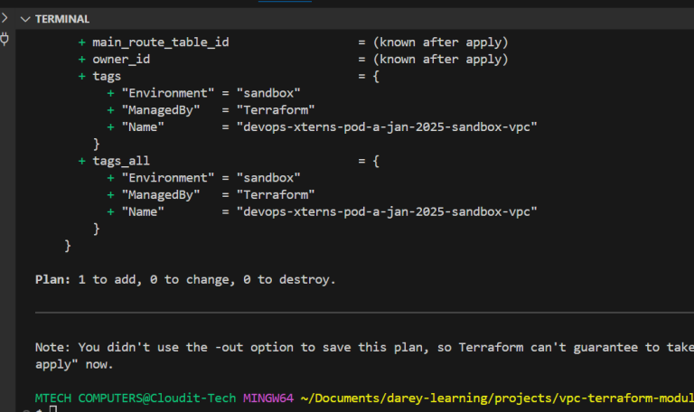

For `staging/production`:

Repeat the same process

**7.3 Apply the Deployment**

For `sandbox`:

Run:

```
terraform apply -var-file=terraform.tfvars -auto-approve
```
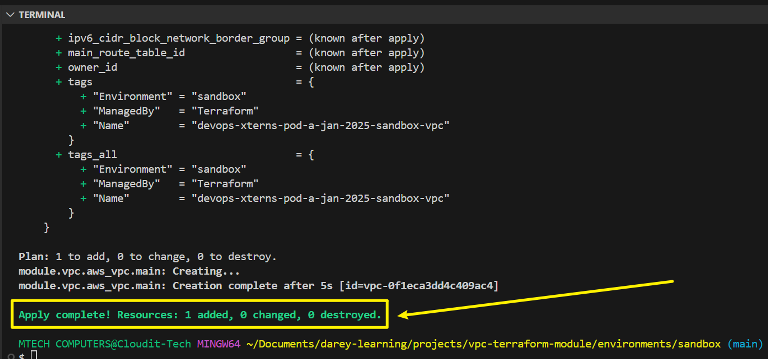

For `staging/production`:

Repeat the same process

## Step 8: Verify Deployment in AWS Console

1. Sign in to AWS Console for the **Non-Prod account**
2. Go to **VPC Dashboard** → Check for `devops-xterns-pod-a-jan-2025-sandbox-vpc`.

    

3. Sign in to AWS Console for the **Prod account**.
4. Check for `devops-xterns-pod-a-jan-2025-staging-vpc` and `devops-xterns-pod-a-jan-2025-production-vpc`.

    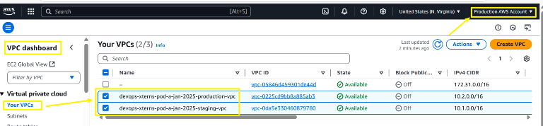

## Step 9: Cleanup

To remove VPCs:

Run:

```
terraform destroy -var-file=terraform.tfvars -auto-approve
```
**For `devops-xterns-pod-a-jan-2025-production-vpc`**

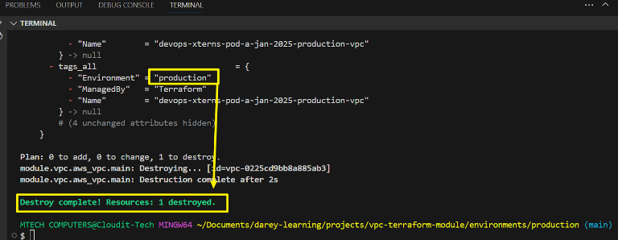

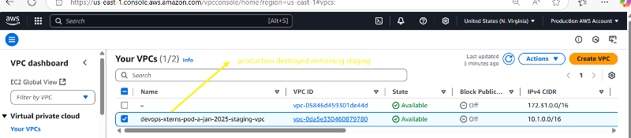

For `devops-xterns-pod-a-jan-2025-staging-vpc`

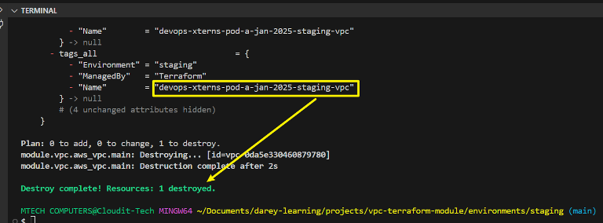

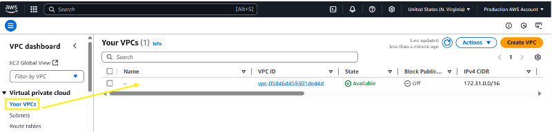

**For `devops-xterns-pod-a-jan-2025-sandbox-vpc`**

## ERROR:

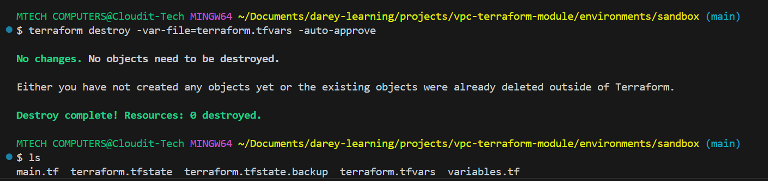

**REASON:**

Terraform no longer tracks my sandbox VPC in its state file, which is why it thinks there’s nothing to destroy. This can happen if:
- The VPC was manually deleted from the AWS Console.
- The Terraform state file got corrupted, lost, or modified.
- The Terraform state was not properly initialized in your environment.

**🛠 Steps to Fix & Force Destroy the VPC**

1. Verify Terraform State

Run the following command to check if the VPC exists in Terraform’s state:

```
terraform state list
```

- If your VPC is not listed, Terraform has lost track of it.
- If the VPC is listed, you can destroy it with:

```
terraform destroy -var-file=terraform.tfvars -auto-approve
```

2. Manually Import the VPC (if necessary)

If the VPC exists in AWS but is missing in Terraform’s state, import it manually:

1. Verify AWS Credentials

Ensure Terraform is using the correct AWS credentials:

```
aws sts get-caller-identity
```

2. Then, re-run:

```
terraform init
terraform import module.vpc.aws_vpc.main <your-vpc-id>
```

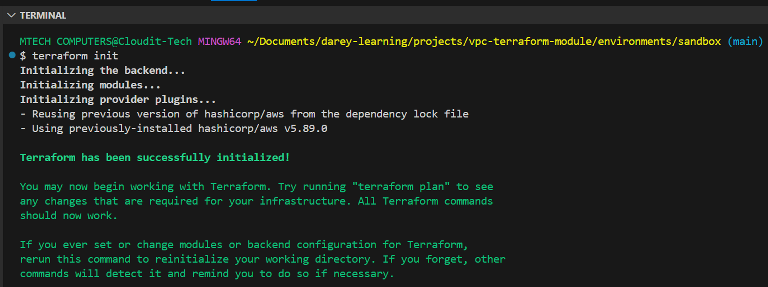

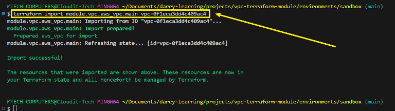

Replace `<your-vpc-id>` with the actual VPC ID (e.g., `vpc-12345678`). You can find this in your AWS Console.

3. After importing, try destroying again:

```
terraform destroy -var-file=terraform.tfvars -auto-approve
```

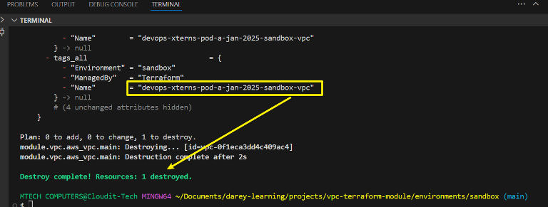

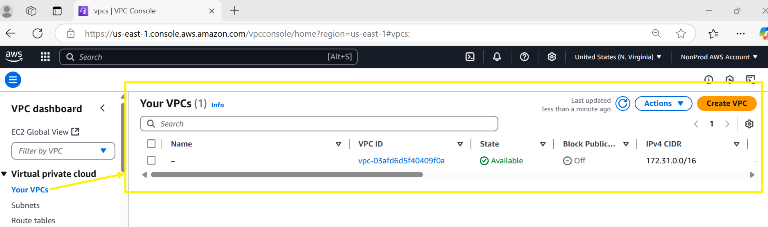

# Conclusion

The **Reusable VPC Terraform Module** project provides a streamlined approach to managing AWS VPCs across sandbox, staging, and production environments. By implementing Terraform modules, organizations can maintain consistency, reduce manual configuration errors, and enhance the scalability of their cloud infrastructure.

The project highlights best practices in structuring Terraform projects, setting up AWS accounts, and deploying environment-specific configurations. Additionally, addressing errors like missing Terraform state files reinforces the importance of proper state management and synchronization.

Through this approach, we ensure that VPC provisioning is **automated, reliable, and easily maintainable**, paving the way for efficient cloud networking operations.